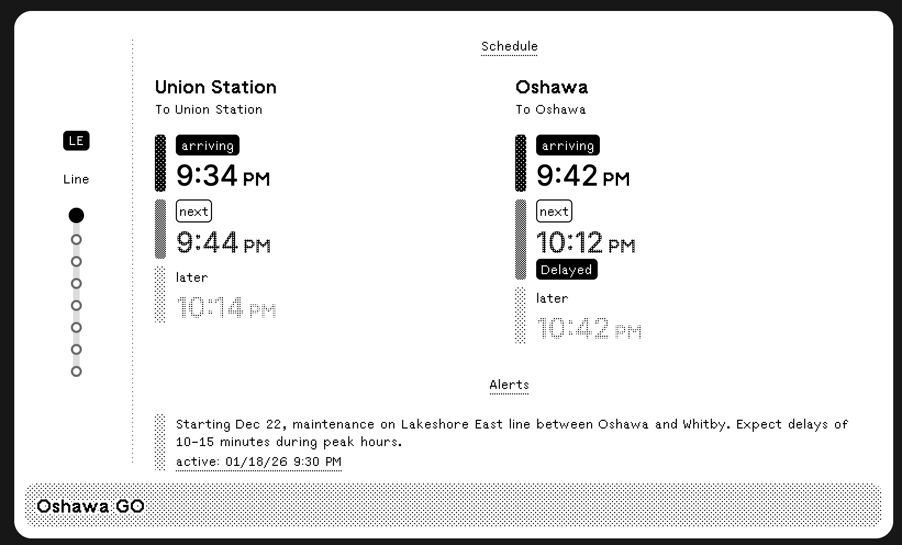
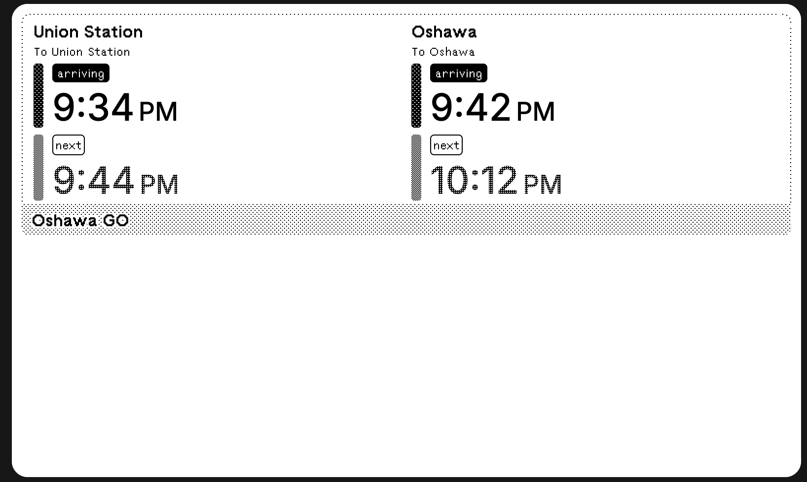
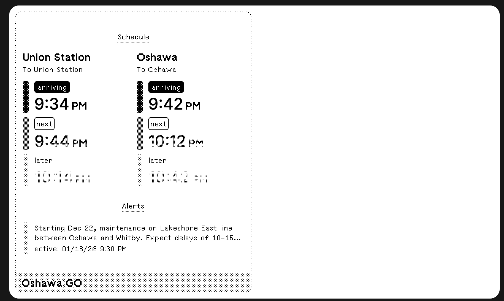

# GO Transit Dashboard for TRMNL


Real-time GO Transit departure and arrival information on your TRMNL display.

> Your commute, at a glance. Never miss another train.

## Install

**[→ Install GO Transit Dashboard](https://usetrmnl.com/recipes)**

1. Visit [TRMNL Plugins](https://usetrmnl.com/plugins)
2. Search for "**GO Transit Dashboard**"
3. Click **Install**
4. Configure your home station and API key
5. Add to your [Playlist](https://usetrmnl.com/playlists)

## Demo

| Layout | Preview |
|--------|---------|
| **Full** |  |
| **Half Horizontal** |  |
| **Half Vertical** |  |
| **Quadrant** |  |

## Features

- **Real-time Updates**: Departure times refresh every 5 minutes
- **Multiple Directions**: View trains in both directions from your station
- **Service Alerts**: Stay informed about delays and maintenance
- **Station Position**: Visual indicator showing your station on the line
- **Four Layouts**: Full, half horizontal, half vertical, and quadrant views
- **E-ink Optimized**: Clean, high-contrast design for TRMNL displays

## Configuration

### Required Settings

1. **API Access Key**: Your Metrolinx Open Data Access Key
   - Register at [GO Transit Open Data](https://www.gotransit.com/en/open-data)
   - Keys are free and activate within 24-48 hours
2. **Home Station**: Select your primary GO station from the list

### Optional Settings

- **Line Filter**: Filter departures for a specific GO Transit line
- **Time Format**: Choose between 12-hour (9:34 PM) or 24-hour (21:34) display
- **Show Alerts**: Enable/disable service alerts and notifications

### How It Works

The plugin fetches real-time data from the Metrolinx API via a Cloudflare Workers proxy:

1. **Data Fetching**: GitHub Actions runs `scripts/update-go-transit.js` every 5-15 minutes
2. **API Integration**: Script fetches from Stop/NextService and ServiceAlert endpoints
3. **Data Transformation**: API response is transformed to plugin template format
4. **Status Calculation**: Compares scheduled vs. actual times to determine delays
5. **Template Rendering**: TRMNL renders the appropriate layout with live data

**API Endpoints Used:**
- `Stop/NextService/{StopCode}` - Real-time departure predictions
- `ServiceUpdate/ServiceAlert/All` - Active service alerts and delays

## Data Sources

This plugin uses the [Metrolinx Open Data API](https://www.gotransit.com/en/open-data):
- Real-time trip updates
- Service alerts
- Station schedules

## Project Structure

```
trmnl-go-transit-plugin/
├── .github/
│   ├── workflows/
│   │   ├── pages.yml          # GitHub Pages deployment
│   │   └── update-data.yml    # Scheduled data updates
│   └── copilot-instructions.md
├── api/
│   └── data.json              # Public API endpoint
├── assets/
│   ├── icon/                  # Plugin icons
│   └── demo/                  # Demo screenshots
├── project-resources/
│   ├── docs/
│   │   ├── PRD.md             # Product requirements
│   │   └── NEW_RECIPE_GUIDE.md
│   └── GO-GTFS/               # GO Transit GTFS data
├── scripts/
│   └── update-go-transit.js   # Data update script
├── templates/
│   ├── full.liquid            # Full-screen layout
│   ├── half_horizontal.liquid # Half horizontal layout
│   ├── half_vertical.liquid   # Half vertical layout
│   └── quadrant.liquid        # Quadrant layout
├── data.json                  # Current transit data
├── index.html                 # Local preview page
├── settings.yml               # Plugin configuration
└── README.md
```

---

**License:** See [LICENSE](LICENSE)

**For Developers:** See [project-resources/docs/](project-resources/docs/) for development documentation.
