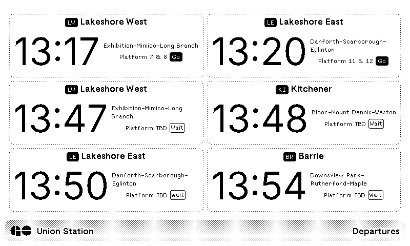
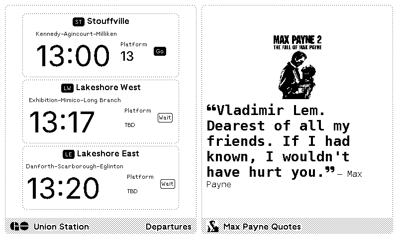
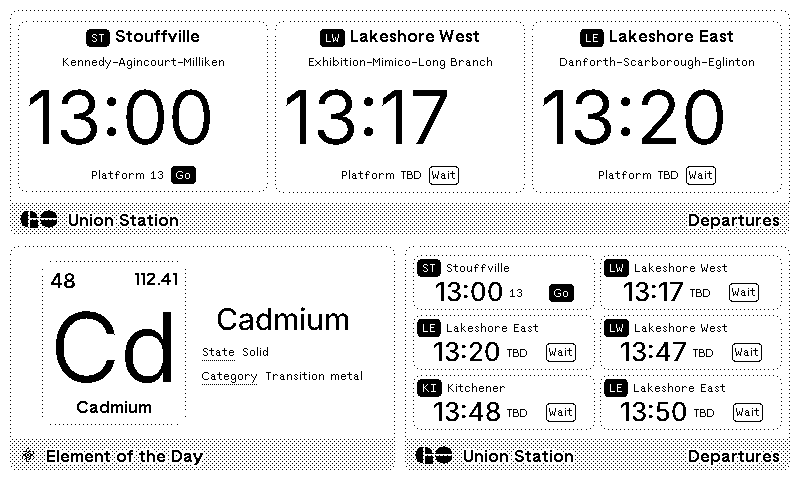

# GO Transit Dashboard for TRMNL

Real-time GO Transit departure and arrival information on your TRMNL display.

> Your commute, at a glance. Never miss another train.

## Install

**[→ Install GO Transit Dashboard](https://trmnl.com/recipes)**

1. Visit [TRMNL Plugins](https://trmnl.com/plugins)
2. Search for "**GO Transit Dashboard**"
3. Click **Install**
4. Configure your home station and API key
5. Add to your [Playlist](https://trmnl.com/playlists)

## Demo

| Full Layout | Half Horizontal Layout |
|-------------|------------------------|
|  |  |
| **Half Vertical Layout** | **Quadrant Layout** |
|  |  |

## Features

- **Real-time Updates**: Departure times refresh every 5-15 minutes via Cloudflare Worker proxy
- **Multiple Directions**: View trains in both directions from your station
- **Service Alerts**: Stay informed about delays and maintenance
- **Station Position**: Visual indicator showing your station on the line
- **Four Layouts**: Full, half horizontal, half vertical, and quadrant views
- **E-ink Optimized**: Clean, high-contrast design for TRMNL displays
- **52+ Stations**: Support for major GO Rail stations across all lines
- **Customizable**: Time format (12h/24h), line filtering, and departure count options

## Configuration

The plugin supports two display modes:

1. **Station-to-Station Schedule** - Shows arrival/departure times between two stations with route visualization
2. **Departure Board** - Shows real-time departures like the GO Transit website

Configure the plugin through the TRMNL interface:

- **GO Station**: Select your preferred station
- **Time Format**: 12-hour or 24-hour display
- **Refresh Interval**: 5-30 minutes (5-minute minimum)
- **Optional**: Filter by line, toggle alerts, customize departure count

---

**License:** See [LICENSE](LICENSE)

**Learn More:** See [project-resources/docs/](project-resources/docs/) for technical documentation, API details, and developer guides.
